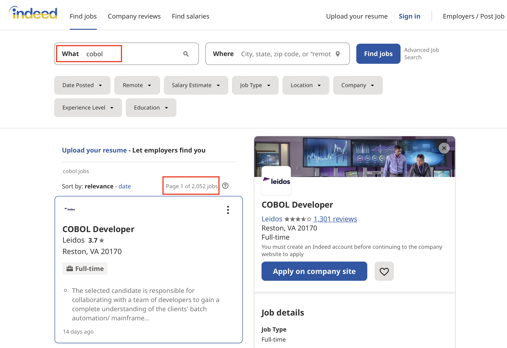
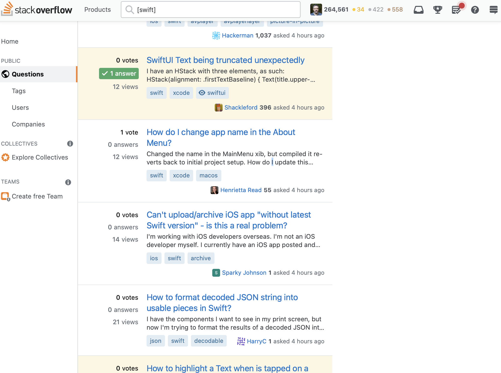
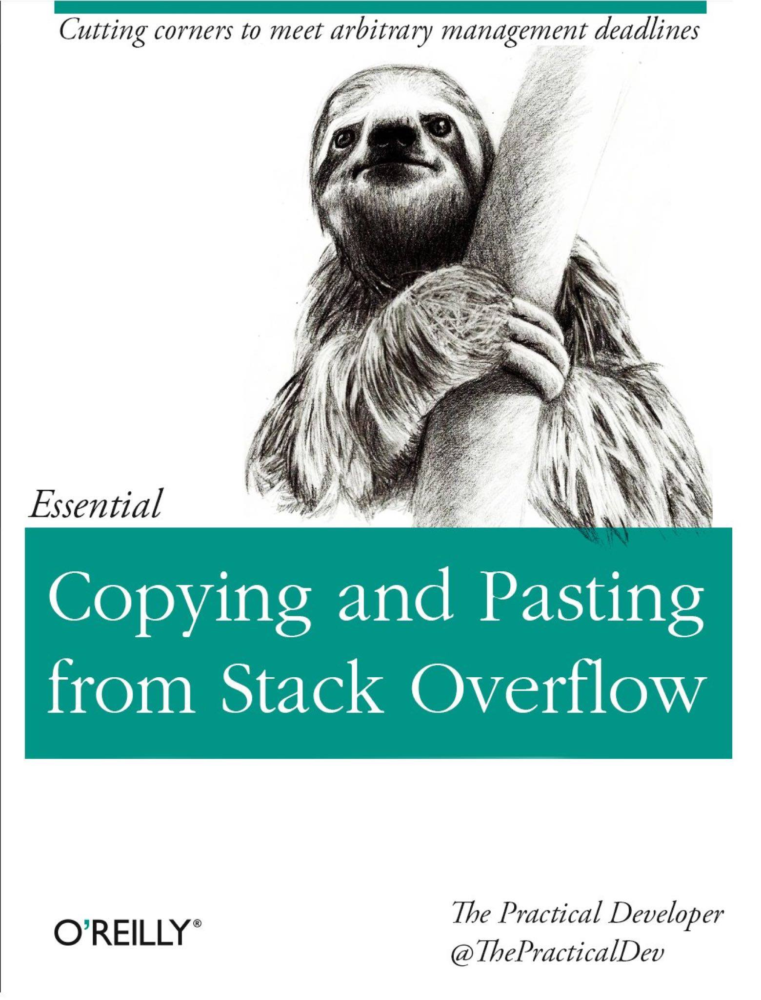
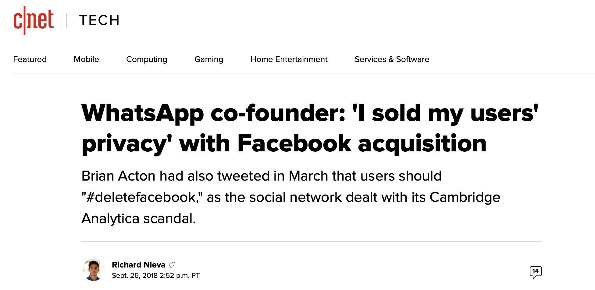

# A Career is Longer Than You Think
## Rob Napier - March 2022

### [https://github.com/rnapier/career](https://github.com/rnapier/career)

^Good afternoon. I’m Rob Napier. I’m 49 years old. I’ve been programming since I was 8. I’ve been a professional computer person since I was 15. I’ve been out of college for 28 years, and I may still work for 20 more. A career is longer than you think. And what I want to talk to you about today is how to plan for that. All the text of this talk is online at this link. I’ll show it again at the end.

---- 

# A lot of jobs

* WBTV — BASIC, COBOL, dBASE, NetWare Sysadmin
* Nortel — DMS 10, Unix Sysadmin
* Bell & Howell — Release Engineer
* Cisco — Build Engineer, ClearCase, InfoSec, Mac/iPhone
* Dell/KACE — Mac Developer
* Logitech — iOS and Mac Developer
* Audible — iOS (this month!)

^My path isn’t the same as your path. My path isn’t even that typical. I’ve had a lot of strange twists and turns in this career. But a lot of people have strange twists and turns, so maybe that’s not so special.

^I’m on my 13th job for my 7th company, not counting a dozen or so freelance gigs. I’ve never been laid off or fired. I’ve been continuously employed since I graduated from college in 1994 with a computer engineering degree. I just got a new job this month working for the Audible iOS team.

^I’ve worked for Nortel, headquartered right there in Ottawa, and Cisco, and Logitech. But I’ve also worked for a small company that makes the machine that folds up your electric bill and sticks in an envelope. I worked for a television station. I was a Macintosh developer for Dell, which is just as weird as it sounds. And I used to sneak into buildings in China in broad daylight to check their security.

---- 

# Not what I thought

^And none of that was what I thought I would be doing when I was 20. I thought I’d join the Air Force and work on missile guidance systems, until an Air Force recruiter talked me out of joining the Air Force, and he was right, and I’m glad I didn’t do that. My life would have been very different.

---- 

# Luck favors the prepared

^You don’t know what the future holds. But that doesn’t mean you can’t make some plans and have some strategies. So I’m going to talk a little bit today about strategies that I’ve seen work over the last few decades and that might help you, too.

---- 

# Growing in your job

^The first thing I’m going to talk about is how to keep growing in your job. The tech industry changes all the time, and that means we need to keep changing with it. There are broad skills that last forever, and are very portable. How to debug hard problems. Probably the most important skill you’ll ever develop.

^But most concrete skills go stale. One day it’s Objective-C and Java, then it’s Swift and Kotlin. It’s UIKit, then it’s SwiftUI. It’s a desktop, it’s a phone, it’s a watch, it’s glasses, it’s brain implants. Our industry is always changing. There was a new version of Fortran released in 2018.

---- 

# There’s always a community

^We have to keep learning and gaining new skills. Whatever technology you’re working in, there’s a community. Find out where people in that community “hang out.” 

---- 

# Keeping up with changes

[.column]
* Blogs
* Forums
* Mailing lists

[.column]

* Discord
* Slack
* Social media

^What do they read? Where are new things announced? Join the mailing lists, or the forums, or the Discord.

^Communities are also where you ask questions. Where you find new jobs. They’re where you discover new patterns and new ways of doing things.

---- 

> Just because it’s your career, doesn’t mean it has to be your whole life.

^I’m not suggesting that you devote huge amounts of time to this. Just because it’s your career, doesn’t mean it has to be your whole life. But you need to keep aware of what’s happening in your field.

---- 
[.autoscale]
# iOS/Swift Resources

* Twitter (a few to get started)
	* @AirspeedSwift, @dgregor79, @ishabazz, @jckarter, @johnsundell, @krzyzanowskim, @mjtsai, @objcio, @steipete, @twostraws
* [forums.swift.org](https://forums.swift.org)
* WWDC Videos ([developer.apple.com/videos](https://developer.apple.com/videos))
* Hacking With Swift ([hackingwithswift.com](https://www.hackingwithswift.com))
* [objc.io](https://objc.io)

^If you’re an iOS developer, that means at least skimming the summary emails from the Swift forums, looking over Evolution proposals, and, if you can bear it, Twitter. As a long-time iOS developer, Twitter is where iOS developers hang out. It’s the place you can hear directly from the people at Apple who are designing the language. The forums are much more in depth, but a much bigger commitment. I personally don’t have time to keep up the forums. I let people on Twitter tell me what thread I need to go skim to know what’s coming in Swift.

^This doesn’t mean you should adopt every new innovation into your products. You shouldn’t. Developers jumping onto the latest, coolest thing is a common cause of failed projects. But, when your team has a new problem, you want to be the person on the team who can say “hey, there’s something available to solve that,” or something coming soon. It also lets you avoid building on things that are going to be deprecated next year.

---- 
# Sticking to what you know

^Some people like to find one technology and stick to it for their whole careers. I know a lot of people who have worked in a single language for 20 years. Just because something is old doesn’t mean there aren’t jobs. 

---- 

^Go put “COBOL” into any job search engine and you’ll find a few thousand jobs. And there’s less competition for them. So if you find something you love, don’t think you have to change.

---- 

# Learning new things (quickly)

^But, being willing and able to adapt to new technologies can give you more options. So how do you do that? I’ve shipped products now in a dozen languages, and I’ve done hobby-level work in about a dozen more. So I have some thoughts on how to learn them when you need to.

---- 
# Languages are more than Syntax

^The first thing you need to know is that languages are more than syntax. This is a really common misconception among programmers who know one or two languages. They think every language has the same basic structures, and they just need to know how to spell it, what keys to press. This isn’t true. Computer languages are different in many of the same ways that human languages are different. And learning them takes more than just getting a translation dictionary.

---- 

> The determined Real Programmer can write FORTRAN programs in any language.
-- (Ed Post, [Real Programmers Don’t Use Pascal](http://scihi.org/fortran-programming/), 1982)

^ There is a wise old saying that it’s possible to write FORTRAN in any language, and that’s a bad thing. And I see that a lot with people trying to force Swift to be the same as Java, or Kotlin to be the same as Swift.

---- 

# Not everything is an object

^You probably studied Object Oriented programming here. Every program teaches it. Classes, inheritance, encapsulation, polymorphism. Let me let you in on a secret. Most modern languages are not object oriented. Go, Rust, Elixir, Elm, Zig, Haskell, Clojure, none of them have class inheritance. Swift has class inheritance for compatibility with Objective-C, but generally discourages subclassing.

^The most common way that students are taught to decompose problems is not how modern languages decompose problems. So when you learn a new language, you may have to think in a different way. Swift protocols are not the same as C# interfaces, which is why I find experienced C# programmers the hardest to teach Swift.

---- 

> You sometimes need to forget what you know to learn something new.

^So, when you want to learn a new language, I really recommend putting aside some time, at least 2-3 weeks, to spend some time with the language and get used to it. I don’t mean full-time, quit your job. But probably an hour or two a day working on it.

^Read the documentation, particularly the introduction to the language. Don’t just skim the reference looking for the syntax for each feature you think you need. A lot of learning a language is forgetting about other languages and starting fresh.

^Go through the tutorials or examples. Use whatever editor or IDE you really intend to use, and type the code in by hand. Don’t cut and paste anything, even if you’re just typing in examples from a book. Get the feel of programming in this language. You may make mistakes. Debug them. That will teach you a lot.

^At that point, I like to build a small project. If you had something in mind that led you to pick this language, of course work on that. But it’s also nice to have some standard project you use. I build a small app that searches Wikipedia and renders the contents of pages. It’s pretty straightforward, but involves a pretty complicated API, some asynchronous work, rendering web pages. I sometimes build a parallel web crawler. Some people like to build a tic-tac-toe program. But build something small.

^At that point, you won’t know the language, but you’ll know enough to start learning the language without fighting it.

---- 

^I assume everyone here is familiar with Stack Overflow. If you’re not, it’s probably the most famous programming question-and-answer site in the world.

^Once you’ve spent a few weeks getting used to a language, if you really want to learn it, I recommend answering questions on Stack Overflow. Wait. “Answering” Stack Overflow questions. Yes. “After 3 weeks?” Yes. Right now I’m doing it to learn Rust.

^Nothing teaches you more about a system than solving problems in it, and Stack Overflow provides many, many problems to solve, at all levels of difficulty. Now, many times, by the time I figure out the answer, someone else had already answered it, but that’s not a bad thing. I still learned something. And I get to see someone else’s answer to compare to my own. And sometimes my answer is better, so I post it anyway. And sometimes I’m wrong, and people would correct me, and that teaches me a lot, too.

^Stack Overflow is a great resource for learning, not just by searching and asking, but by answering. And, as a side note, Stack Overflow has been my number one generator of freelance clients.

---- 

^Not quite related, but since I’m talking about Stack Overflow I want to talk about copying code from Stack Overflow, or from the internet generally. Our industry shames people for copying off of Stack Overflow. But this isn’t right. 

---- 

> The whole point of Stack Overflow is to provide answers.

^It’s fine to copy off of Stack Overflow. I do it all the time. There is nothing wrong with copying good things that someone else has shared. But there are good and bad ways to copy.

---- 
# Copying Stack Overflow correctly

* Type. Don’t Paste.
* Know what the code does.
* Make it fit with your code.
* Credit it.

^I almost never cut and paste. I usually retype the code by hand. And I dig into what each piece of the code is doing, and why it’s there. I often rework the code as I go along to match my team’s style,. And if the final code is nearly identical to something I found, I include a link to where I got it. That way other developers can get more information about why it’s this way. If it was complicated enough that I needed to copy it off the internet, it’s generally complicated enough to be worth explaining.

---- 

# Growing in another job

^Learning new things is really important for growth, but sometimes you also just need to move on to a new job. I’ve done this a lot. There are several reasons to decide to switch jobs, and I want to take them one by one because they’re kind of different. Once you decide, though, actually changing jobs is kind of the same.

---- 

# Raises happen when you switch

* Less than 2 years is “job-hopping”
* 5 years is plenty (but you don’t have to leave!)

^The first reason, and the one that will impact you all the soonest, is money. It’s an unfortunate fact that the primary way you get a raise in our industry is by changing jobs, generally by moving to a new company. Even promotions often don’t come with much of a raise, and internal transfers almost never do. Improving your base salary early on can make a big difference long-term. And the best way to improve your base salary is get another job.

^Now this has a big problem. Employers do not like job-hoppers, which is understandable. For most projects, a new-hire isn’t even very useful for 6-12 months. So job-hopping is how you get more money, but can also make getting the next job harder. You need to balance these, or you’ll get stuck.

^Rule of thumb: 2 years. Less than 2 years at multiple companies and you look risky. Not a hard-and-fast rule. You can probably get away with one year here and there. But you have a string of 6-month jobs, and you’re going to raise a lot of eyebrows.

^Right out of school, provided you don’t go to one of the tech giants, there’s a reasonable chance you’ll be in a pretty low paying job. “Low paying” is very relative. Our industry is very well paid. My first job out of college paid almost as much as my mom made a librarian with 25 years experience and a Master’s degree. But I was still actually underpaid.

^Once you get yourself to a job that pays reasonably, I recommend staying put at least 2 years. Early in your career it can make sense to move a bit just to get different experiences and find what you really want to do, but eventually you probably want to settle into 4-5 year stints. Beyond that, I don’t find you get any “credit” for staying in a job longer. Don’t feel you have to leave if you’re happy, but after 5 years it doesn’t really matter to your new employer in my experience. And doing exactly the same thing for too long and keep you from growing. But five years is pretty common.

---- 

## levels.fyi
## glassdoor.com

^When I say “paid reasonably,” how would you know? I recommend sites like Levels and Glassdoor to get a good idea. In my experience, talking to lots of people who share salary information, Levels is the most accurate, but it covers fewer companies. Glassdoor is good for junior roles, but sometimes is way off more senior roles.

^If you do find yourself in a very underpaid job, you should change jobs as soon as you can. You do not owe any loyalty to a company who has clearly not shown loyalty to you. I owe professionalism, integrity, honoring your promises, but not loyalty. If a company is dramatically underpaying you, they don’t expect you to stay. And very good evidence that you’re underpaid is that another company is willing to pay you a lot more.

^Most companies want to pay you based on what you’ve been paid in the past. More than once, I’ve had the pay of a new job adjusted down because they felt it would be too big a raise. I had a job that was reclassified two pay grades lower because I was making $10,000 less than the minimum for the posted pay grade. They did not change the job requirements, by the way, just the pay grade. That’s why getting you base pay up early in your career can have a major impact.

^By the way, you’re not required to tell a new employer what your old employer paid you. Don’t lie about it, but it’s not their business. But when you transfer within a company, they already know what you’re being paid.

---- 

# Let’s talk about titles

^Titles are a funny thing. They’re sometimes treated as part of your compensation. “We can’t give you a raise, but here’s a fancier title.”

^This had led to a lot of title inflation in our industry. I keep running into “senior” developers with three years of experience. I promise you, you are not a senior developer at that point. The difference between a senior developer and a very smart junior developer is when facing a complex problem, a junior developer has great ideas for how to solve it. A senior developer has faced this exact problem before, several times.

^But still, we have a mismatch of titles that often don’t mean anything, and they definitely do not substitute for pay. No one is fooled when you call yourself the CTO of a 10 person startup.

^So, if you are from an over-represented group, like I am, white, male, middle-class background with a college degree, my experience is that titles don’t matter. I’m a very senior member of my team, and for years my official title has been “software development.” Not even “developer.” “Development.” And that’s totally fine with me.

^But, the same is not true for under-represented groups, and especially women. Sexism is rampant in this industry, and I have had many women tell me that titles absolutely matter for getting the respect they deserve. So, it depends on your situation.

---- 

# Running To

^Pay isn’t the only reason to change jobs. Once you get your base pay to a place you’re comfortable with, it’s not even that important a reason.

^The best reason to change jobs is “running to.” You find a job that offers new opportunities. Maybe it’ll move you to a city you want to live in. Maybe it’ll let you work on something you’re passionate about. A technology or a cause. 

^Unless you’re currently in a job that you would “run to,” I recommend always keeping an eye on what’s out there. I don’t recommend the big job boards for this. Monster, or Indeed, or the like. Those can be useful for finding a job when need a job, but that’s not really where you’re going to find great jobs.

^If you’re at a larger company and you’re happy with it, watch the internal job boards. Internal transfers can be really nice. I was at Cisco for 12 years, but I had 4 completely different jobs while I was there.

^Personally I’ve had a lot of luck with Stack Overflow’s job board. And also if you can join a tech community like on a Discord or Slack or a Meetup, those tend to have much higher quality postings. In the iOS world, I again recommend Twitter, because there are a ton of very high-profile folks there, and good jobs get posted a lot. The point is, though, once you’ve gotten your pay to a reasonable place, look for those “run to” jobs. 

---- 
# Make your moves count

^I don’t recommend moving for “a little better.” To avoid excessive job hopping, you only get so many moves. Every job has its good and bad points, so moving over a small change in pay or a slightly more interesting project is just as likely to include a lot of things you don’t like. Look for moves that are clearly better than what you have. The best time to look for a great job is when you have a good job.

---- 

# Running from

^On the other hand, sometimes the company is just dysfunctional, and you need to leave. The biggest thing to look for is when everyone knows what the problem is, but there’s are no actual progress. When teams say they need to communicate better, but a year later it’s exactly the same. When everyone knows the managers all backstab each other, but the managers keep getting promotions. When more of your time is devoted to dealing with internal concerns, politics, processes, rather than solving real, technical problems for customers. And of course if the company is abusive to its staff or violating the trust of its customers. A company who is deceptive to the world will also be deceptive to you.

^My simplest rule is, if our customers came into our design meetings, would that be a problem? And if it its, you’re probably in a “run from” situation.

^In that case, forget the two years. Just get another job. Try not to take a pay cut. But get another job as quickly as you can. Don’t wait for the company that’s abusing others to abuse you. Don’t wait until the company is in the news and you look bad by association. Get out.

^Even if there’s nothing deeply wrong with a company, when it’s clear that it’s failing, it is definitely more advantageous for you to leave before it fails than waiting to get laid off. It’s always easier to get a job when you have a job.

---- 

^OK, back to finding jobs. I can’t leave this topic without discussing the 800 pound gorilla, LinkedIn. LinkedIn the weirdest social network. Most everyone has an account, and most everyone ignores it. You really should have an account, and you will probably want to ignore almost every single thing sent to it. It’s very strange. But it’s that “almost” that makes the difference. LinkedIn is *almost* useless, but it’s just barely useful enough to stay.

^Now, when you’re looking for your first a job, it’s a bit more useful because it’s what recruiters use to find you. The thing is, recruiters search LinkedIn for keywords, and they mail pretty much everyone they find. It’s complete spam. Most recruiters you’re going to run into work on a contingency basis. They only get paid when they refer a candidate who is selected. So they mail everyone and hope one of those people applies and gets hired. They have no incentive to limit who they mail, or to put much effort into getting you hired. But, when you don’t have a job, all that spam can be somewhat helpful.

^Once you do have a job, LinkedIn recruiters are a constant buzzing noise. Building up a network of hundreds and hundreds of people you don’t know is not particularly useful. But what is useful about LinkedIn is that it’s a way to keep track of people you do know professionally. And that helps when your team wants to hire someone, or you see a job posting that you don’t want but maybe someone you know could use. So it’s worth it.

---- 

# Big choices
## Big companies
### Manager or IC

^As you start your career, one of the bigger choices you’re going to make is deciding what “track” you want to be on. There are a few choices, but I’m going to start with the manager versus technical tracks.

^This is a choice you’ll make if you work at almost any company larger than a startup. And I see a lot of people get it wrong, and regret their choices. The key thing is that you should not think of management as a promotion from technical or “Individual Contributor” roles. It’s a different career path. It requires different skills, and it offers different rewards. I’ve never been a manager. I’m a programmer. I am a very well paid programmer. But I still write code pretty much every day. I also act as a team lead and I do a lot of mentoring and the like. But at the end of the day, you can make a full career out of just writing code if you want.

^Learning to lead people and organizations is a different path. Ultimately it can make a lot more money, particularly once you get into executive management. But in most larger companies, moving from a senior engineering role to a first line manager role is actually a pay cut, which is why I recommend if you really want to go into the management track, that you start preparing for that early in your career, and looking into roles like Project Manager, which often lead nicely into people manager roles. You should also try early on to lead small teams to start building those skills.

^It’s very common, to the point of being a cliche, for senior engineers to become managers, only to boomerang back to technical roles. I’ve seen so many highly skilled developers become terrible managers, and many of my best managers had never been developers and didn’t know that much about programming. What they did know was how to manage programmers and get software out the door. It’s a different skill.

---- 
# Little choices
## Startups

^Startup life is different, and I’ve had a lot of friends who have led a serial startup life. The important thing to know is that unless you’re one of the very, very first employees, like less than 10, you are very unlikely to make great money at a startup. For most people, even counting an IPO or acquisition, you would have made more money working for any large company, not even the big tech giants, just any large company. Typically the only people who strike it rich in a startup are the founders and the first few employees. But those are also the people who are most likely to spend years and make literally nothing, when they could have had highly paid jobs elsewhere.

^My point is that startups are a lifestyle. If you love startups, work at startups. If it’s your dream to found a company, found a company. Just don’t do it for the money. There are a lot easier ways to make money in this industry. 

---- 

# \<soapbox\>

^I’m going to soapbox for just a moment here about startup business models. If you don’t have a clear picture of how what you’re working on is going to make money in a positive way, it’s going to eventually make money in a negative way or go out of business.

^The founders of WhatsApp wanted to build a very privacy-centric messaging app. And they did. But they had no plans for how to make money from it. Facebook came along and bought it for 19 billion dollars without ever saying how they planned to make all that money back.

---- 

^ The founders were then shocked, shocked! that Facebook tore down the privacy protections. As we often ask in my family, what did you think was going to happen?

^I bring this up because you may decide to join a startup, or even one of the big tech companies, and if things like privacy, human rights, democracy, are important to you, you need to ask “how does this company make its money?” If the answer is “we’ll get bought by someone,” then ask “how do you think *they* will make money off of what you’re building?” If you don’t like the answer, or can’t figure out what the answer would be, I suggest not taking the job. When tech companies do evil things, it almost always included an engineer who was willing to implement it.

---- 

# \</soapbox\>

---- 

# Life choices

^A related point is deciding what’s important to you. For example, for much of my career, a key requirement is that I work from my home in Raleigh, North Carolina. I decided that was important to me when my children were very young. I used to travel a lot and I never got to see them. I realized that no amount of money could ever recreate their childhood, so I accepted significantly less money in order to have jobs where I could see them and go to their school play and coach their teams and all the rest. And I’ve never regretted that. And in the end, there was plenty of money for what we wanted, anyway.

^For some of my friends, what’s important is they want to live in San Francisco. They love San Francisco. Others want to work for startups. I know folks who really want their work to have meaning and purpose and change the world.

^I know a guy who wanted money as fast as possible so he’d never have to work again, and he took the most burn-out job you can imagine, on the road over 300 days a year, traveling to every corner of the world, sleeping in the cheapest hotel rooms. But it gave him the money he wanted, he retired, and he was happy.

^It’s easy to fall into a rut. You graduate. You get that first job. And then you kind of drift along. But I’m encouraging you to think about what you want. Not for 40 years. Nobody knows that. But “where do you want to be in 5 years?” It’s not a bad question. And more important than any specific date, what direction do you want to be headed in, and are you headed that way?

---- 

# Take-aways

* Get your base pay up. You may have to switch jobs.
* Once you’re paid fairly, 2 years minimum. 4-5 is better.
* Keep up with your field. Be part of a community.
* Big companies generally pay better than startups.
* Startups are a lifestyle. If you love it, go for it!
* Make sure you’re going where you want to be.

^And I hope this talk helps you think over those things and think about what you want and how to get started on the right path in this madcap industry. I wish you luck.

---- 

### [github.com/rnapier/career](https://github.com/rnapier/career)
### [robnapier.net]()
### @cocoaphony